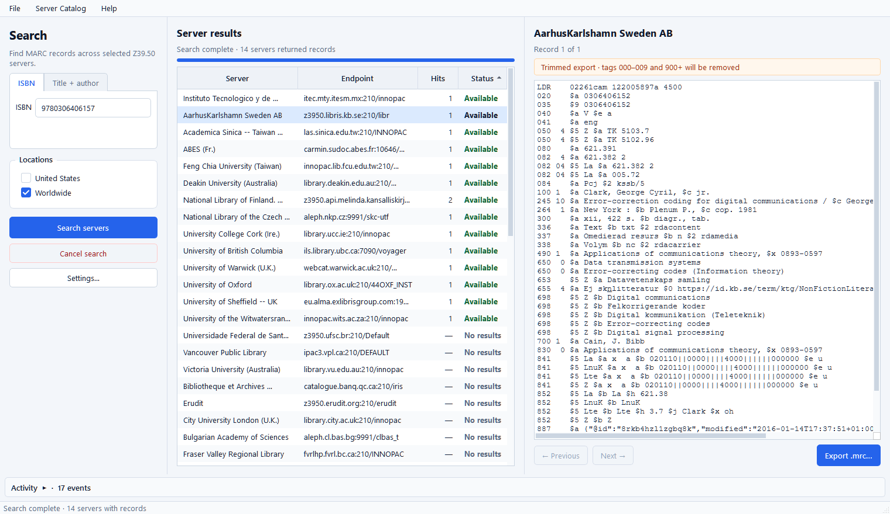
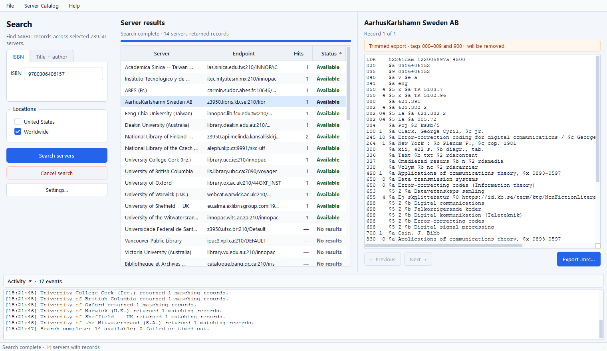

# Z39.50 MARC Search 2.0

Search library catalogs around the world from one Windows desktop application, inspect the MARC
records they return, and export a record as a valid ISO2709 `.mrc` file.



## What it is

Z39.50 MARC Search is a focused copy-cataloging and metadata discovery tool. It sends one search
to many independently operated Z39.50 library servers, collects their responses as they arrive,
and keeps each successful result set open so you can inspect the records behind it.

Use it when you need to:

- Find candidate MARC records without searching library catalogs one at a time.
- Compare how multiple institutions describe the same publication.
- Retrieve a record from the source you trust and import its `.mrc` file into another MARC-aware
  workflow.
- Check whether a Z39.50 target is reachable and whether it holds a particular title.

It is intentionally not a full cataloging system, an ILS, or a bulk harvester. The application
helps you find, review, navigate, and export individual records; your local cataloging system
remains the system of record.

## Who it is for

- Catalogers and technical-services staff doing original or copy cataloging.
- Metadata librarians comparing records across institutions.
- Acquisitions and collection staff checking bibliographic coverage.
- Library systems staff testing Z39.50 targets or retrieving a clean ISO2709 record.
- MARC developers who want a visual client for real-world Z39.50 responses.

No Python, command line, YAZ installation, or development environment is required when using the
Windows installer.

## Features

- **One search, many catalogs.** Query the bundled catalog of verified USA and worldwide Z39.50
  targets concurrently.
- **Two search modes.** Search by a validated ISBN-10 or ISBN-13, or by title and author.
- **Live, independent results.** Results appear as servers finish. A failed, slow, or malformed
  target does not abort the rest of the search.
- **Clear per-server status.** Sort the result table by server, endpoint, hit count, or status; open
  failure details when a target cannot answer.
- **MARC record inspection.** Select any available server to view its first record, then use
  Previous and Next to move through that server's retained result set.
- **Reliable MARC export.** Save either the exact ISO2709 bytes received from the server or a newly
  serialized, trimmed record.
- **Cancelable searches and visible activity.** Stop an in-progress fan-out search and expand the
  activity panel when you want the target-by-target details.
- **Built-in catalog maintenance.** Signed catalog updates, a last-known-good cache, custom-server
  imports, and locally disabled targets are kept separate from the application release.
- **Adjustable behavior.** Configure concurrency, per-server timeout, save directory, record
  trimming, light/dark appearance, and automatic catalog updates.
- **Local settings and no telemetry.** Settings stay under `%LOCALAPPDATA%\Z3950MarcSearch`. The
  application collects no queries, usage data, or failure telemetry. Searches are, of course, sent
  to the Z39.50 servers you select.

## Install on Windows

1. Download the x64 MSI from
   [GitHub Releases](https://github.com/jspann21/z3950_search_for_marc/releases).
2. Run the installer. It installs for the current user and does not require administrator rights.
3. Keep the optional desktop shortcut selected, or open **Z39.50 MARC Search** from the Start menu.

The MSI includes Python, Qt, YAZ, and the native runtime libraries the application needs. Installing
a newer package upgrades the existing copy in place while preserving settings and cached catalog
data.

## Search for a record

1. Choose **ISBN** or **Title + author**.
2. Enter an ISBN-10/ISBN-13, or enter both a title and an author. Spaces and hyphens are accepted in
   ISBNs.
3. Select **United States**, **Worldwide**, or both location groups.
4. Choose **Search servers**. Results arrive incrementally and the progress bar tracks the entire
   target set.
5. Select a row marked **Available** to view that server's first MARC record.
6. If the server returned more than one hit, use **Previous** and **Next** to inspect the retained
   result set.
7. Choose **Export .mrc…**, confirm the destination, and save the displayed record.

The screenshot below is a real search for ISBN `9780306406157`. In this run, 14 of 52 worldwide
targets returned at least one record. Public-server availability and hit counts will vary over time.



### Read the result statuses

| Status | Meaning |
| --- | --- |
| **Available** | The server returned one or more matching records. Select the row to inspect them. |
| **No results** | The server answered successfully but found no match. |
| **Timed out** | The target did not finish within the configured per-server timeout. |
| **Failed** | The target could not connect, rejected the query, or returned an unusable response. Select the row for details. |
| **Canceled** | The search was stopped before that target completed. |

Z39.50 targets are maintained by independent institutions. Different hit counts, field choices,
encodings, and occasional outages are normal; the per-server view is designed to make those
differences visible.

## Export behavior

The record panel always identifies the active export mode before you save:

- **Original export** writes the exact bytes received from the server. Choose this when byte-for-byte
  fidelity matters.
- **Trimmed export** clones the parsed record, removes local/control tags `000–009` and all `900+`
  fields, then serializes a new valid ISO2709 record. The on-screen display follows the same trimming
  policy.

Trimming is enabled by default and can be changed in **Settings**. Exports contain the currently
displayed record only; the application does not silently merge records from different servers.

## Settings and defaults

Open **Settings…**, use **File > Settings**, or press `Ctrl+,`.

| Setting | Default | Purpose |
| --- | --- | --- |
| Concurrent targets | 12 | Balances search speed with local and remote resource use. |
| Server timeout | 5 seconds | Limits how long one target can hold up its own result. |
| Save directory | Downloads | Starting location for `.mrc` exports. |
| Trim records | On | Removes tags `000–009` and `900+` from display and export. |
| Appearance | Light | Switches between the light and dark application themes. |
| Automatic catalog updates | On | Checks for a newer signed server catalog at most once every 24 hours. |

Settings also provides an importer for legacy server JSON. Imported targets become a separate
custom overlay and never overwrite the signed upstream catalog.

## What the project contains

The installed application is self-contained. The source repository separates the product into the
following pieces:

- [`src/z3950_search_for_marc`](src/z3950_search_for_marc): application UI, search coordination,
  settings, MARC processing, catalog loading, and the embedded YAZ integration.
- [`catalog`](catalog): the versioned server catalog, JSON Schema, health state, and catalog
  maintenance documentation.
- [`native`](native): the pinned YAZ build metadata and CFFI adapter build tooling.
- [`installer`](installer): the WiX definition for the per-user Windows MSI.
- [`scripts`](scripts): reproducible native builds, packaging, and installer verification.
- [`tools`](tools): catalog migration and signed publication utilities.
- [`tests`](tests): application, query, MARC, catalog, settings, UI, and native integration tests.

At runtime, the distribution includes the PySide6 interface, the native YAZ protocol engine,
PyMARC record handling, the bundled last-known-good server catalog, license notices, and everything
needed to launch on a supported x64 Windows system.

## What changed in 2.0

- PySide6 model/view UI with incremental results, sorting, keyboard navigation, activity details,
  cancellation, and retained result-set navigation.
- YAZ 5.37.3 embedded through its native asynchronous ZOOM C API and a compiled CFFI adapter.
  There are no subprocesses and no console-text parsing.
- Exact ISO2709 bytes are retained for every fetched record. PyMARC 5.4 handles MARC-8/UTF-8
  parsing and valid serialization.
- Versioned, schema-validated server catalog with signed independent updates, custom-server
  overlays, local disabled IDs, offline fallback, and conservative two-runner health automation.
- Atomic JSON settings under `%LOCALAPPDATA%\Z3950MarcSearch`, including one-time migration from
  the former Qt settings. The obsolete YAZ executable setting is intentionally ignored.

## Run from source

Development uses Python 3.14 and the committed `uv.lock`:

```powershell
uv python install 3.14
uv sync --locked --extra dev
./scripts/build_yaz.ps1
uv run z3950-search
```

`build_yaz.ps1` downloads the pinned YAZ source archive, verifies its SHA-256 digest, builds the
x64 DLL and test server with Visual Studio Build Tools, and compiles the CFFI extension. The
resulting binaries are build artifacts and are intentionally not committed.

## Verification

```powershell
uv run ruff format --check .
uv run ruff check .
uv run mypy src tests
uv run pytest -m "not native"
uv run pytest -m native
uv run python -m z3950_search_for_marc --self-test
```

The native tests start the pinned local `yaz-ztest` target and exercise initialization, concurrent
target isolation, search, present, raw-record retrieval, navigation, and cleanup without relying
on a public server.

## Server catalog

The bundled catalog is [`catalog/servers.v2.json`](catalog/servers.v2.json), validated by
[`catalog/servers.v2.schema.json`](catalog/servers.v2.schema.json). It currently retains 390
definitions for audit history and publishes 215 active, repeatedly verified endpoints. Definitions
have stable UUIDs, numeric ports, normalized endpoint uniqueness, status history, charset metadata,
and explicit Library of Congress priority.

At most once every 24 hours—or when the user chooses **Check server catalog for updates**—the
application fetches the manifest from the configured GitHub Pages HTTPS origin. It validates the
final origin, Ed25519 signature, SHA-256 digest, schema compatibility, IDs, ports, and duplicates
before atomically installing the cache. Startup uses the cached last-known-good catalog, then the
bundled catalog. A bad download cannot replace either.

Catalog maintainers can sign a publication with:

```powershell
uv run python tools/publish_catalog.py `
  --private-key path/to/catalog-private-key.pem
```

The private Ed25519 key must remain outside source control. See
[`catalog/README.md`](catalog/README.md) for health, quarantine, recovery, and release policy.

## Build the Windows MSI

```powershell
./scripts/package_windows.ps1
```

Packaging performs a locked sync, rebuilds YAZ, creates a Nuitka standalone directory, runs the
packaged `--self-test`, and wraps it in `dist/Z3950MarcSearch-2.0.0-x64.msi` with WiX. CI repeats the
clean build and publishes the MSI, checksums, standalone inspection artifact, GPL license, and YAZ
notice.

After the release commit is on `main`, push the matching version tag to create the GitHub Release:

```powershell
git tag v2.0.0
git push origin v2.0.0
```

The release workflow rejects a tag that does not match the version in `pyproject.toml`, then uploads
the tested MSI, SHA-256 checksums, and license notices to the GitHub Release.

The installer is per-user, defaults to `%LOCALAPPDATA%\Programs\Z39.50 MARC Search`, and supports
in-place upgrades. Uninstall removes application-owned `%LOCALAPPDATA%\Z3950MarcSearch` data by
default; an administrator can retain it with `PRESERVEUSERDATA=1` on the `msiexec /x` command.

## License

GNU GPL v3.0. YAZ is redistributed under its BSD license; see the packaged `YAZ-LICENSE.txt`.
